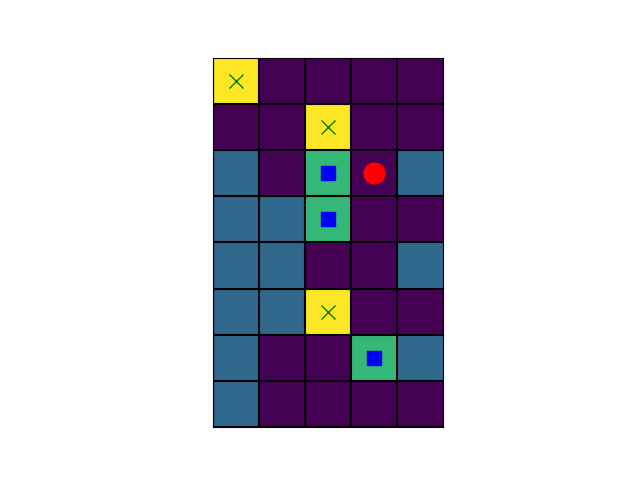
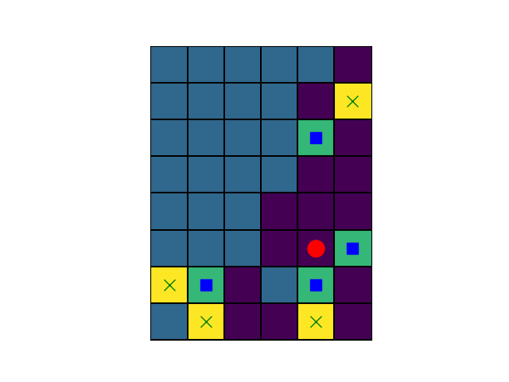
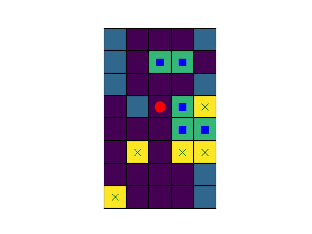
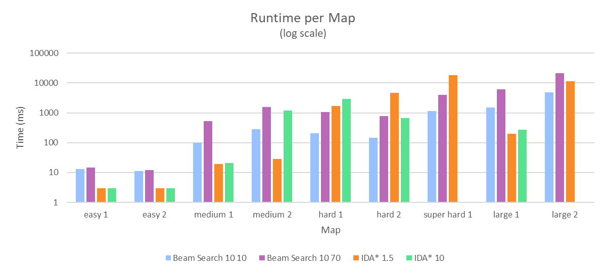
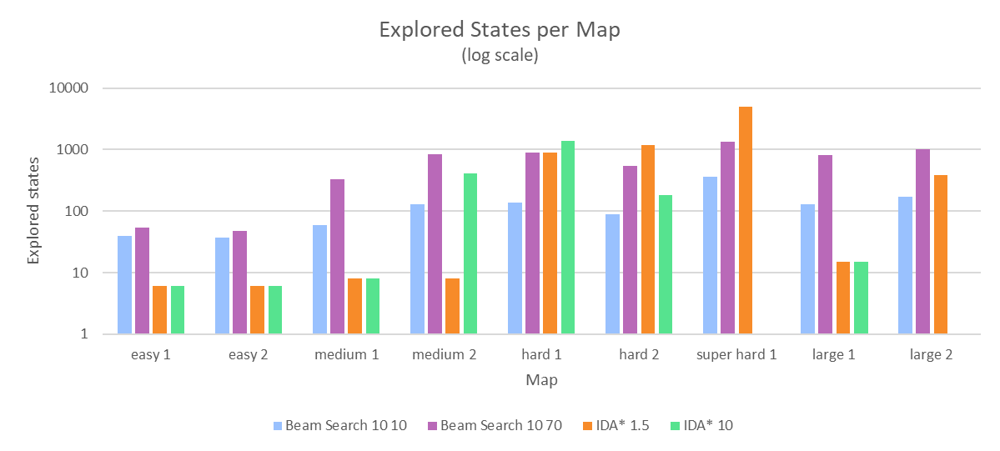
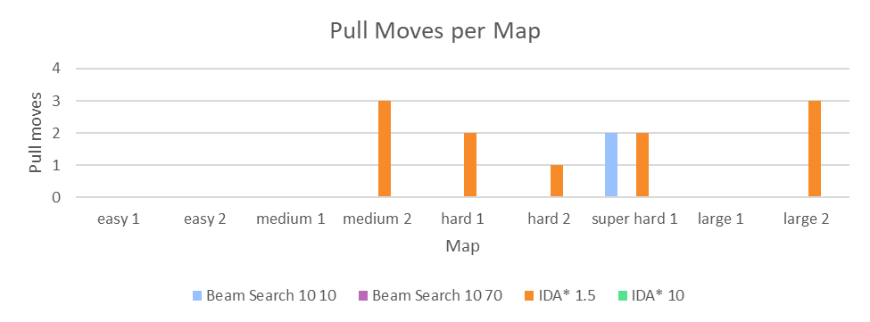

# Sokoban Solver

Sokoban solver implementing **IDA*** and **Beam Search** heuristic strategies.

This project compares different solver configurations with varying pull penalties and beam widths, analysing their impact on performance and solution quality.

## Demo

| Beam Search                                     | IDA*                                       |
|-------------------------------------------------|--------------------------------------------|
|      |       |
|        |         |
|  |  |

[All demo solutions here](demo)

## Problem description

Sokoban is a puzzle game where the player pushes boxes onto target locations on a grid map

### Constraints

* Boxes can normally be **pushed** only, but this project also allows **pull moves** with a configurable cost
* Player movement itself has no cost
* The objective is to place all boxes on target cells

### Move costs

| Move        | Cost           |
|-------------|----------------|
| Push        | 1              |
| Pull        | _configurable_ |
| Player move | 0              |

## Implemented Solvers

The project evaluates 4 different solver configurations:

| Solver | Pull cost | Beam width | Pull Moves | Notes |
|--------|-----------|------------|------------|-------|
| Beam Search | 10 | 10 | ≤2 | Very fast but may use pulls |
| Beam Search | 10 | 70 | 0 | Slightly slower but finds optimal push-only solutions |
| IDA* | 1.5 | - | ≤3 | Solves all maps but may use pulls |
| IDA* | 10 | - | 0 | Solves most maps without pulls but fails on 2 |

## Heuristic

The heuristic estimates how far the current state is from a solution by combining box-target distances with a penalty for solutions that require pull moves.

### Base Heuristic (IDA*)

$`h(state) = \sum_{box}^{}(avg(dist(box, target))) + (pullCost - 1) \times numLockedBoxes`$

#### Box-target distance estimate

For each box, the algorithm computes the BFS distance to every unoccupied target cell. The heuristic uses the average of these distances rather than the minimum.

Using the minimum distance can lead to misleading estimates because the closest target from a box may be the best match for another box. Averaging the distances provides a more stable estimate of the overall effort required to place all the boxes.

Distances are computed using BFS, taking into account walls and obstacles.

To improve performance, distances from every cell to every target are precomputed before the search begins.

#### Pull Penalty

Some box positions cannot be resolved with pushes alone and require pull moves. The heuristic adds a penalty: $`(pullCost - 1) \times numLockedBoxes`$, where `numLockedBoxes` is the number of boxes that require a pull to be moved.

A box is considered locked if the player cannot reach any position behind it (computed with BFS while ignoring other boxes) from which the box can be pushed.

This discourages solutions that rely on pull moves, depending on the configured `pull_cost`.

#### Beam Search Heuristic

$`h_{beam}(state) = h(state) + state.numPullMoves \times pullCost`$

Unlike IDA*, beam search does not keep track of the cumulative path cost when ranking states. Therefore, two states with different numbers of pull moves could appear equally promising.

To address this, the heuristic adds the cost of pull moves already performed in order to reach the current state, preventing the algorithm from favoring states that have already used many pulls.

## Optimizations

* **Box moves only neighbor generation** - generate successor states only when a box is pushed/pulled (player moves are reconstructed later)
* **Reachability prefilter** - cells reachable by the player are precomputed with BFS and box interactions are only considered from reachable positions
* **Precomputed distances** - cell-target BFS distances are computed once and reused during the search
* **Heuristic ordering (IDA\*)** - neighbors are expanded in heuristic order to explore promising branches first

## Experimental Results

[Test maps](tests)

The solvers are evaluated on the set of test maps, using the following metrics:
* runtime
* number of explored states
* number of pull moves

Each solver was given a maximum time limit of 300 seconds per map. If no solution was found within this time limit, the map was marked as unsolved.

Full experiment data in [results/csv](results/csv)

### Solvers legend

| Name              | Algorithm   | Pull cost | Beam width |
|-------------------|-------------|-----------|------------|
| Beam Search 10 10 | Beam Search | 10        | 10         |
| Beam Search 10 70 | Beam Search | 10        | 70         |
| IDA* 1.5          | IDA*        | 1.5       | -          |
| IDA* 10           | IDA*        | 10        | -          |

### Runtime per Map

### Explored States per Map

### Pull Moves per Map

### Results Summary

| Solver | Maps solved | Max pulls | Max explored states | Max time (s) |
|--------|-------------|-----------|---------------------|--------------|
| Beam Search 10 10 | 9/9 | 2 | 360  | 4.80  |
| Beam Search 10 70 | 9/9 | 0 | 1340 | 20.95 |
| IDA* 1.5          | 9/9 | 3 | 5017 | 18.09 |
| IDA* 10           | 7/9 | 0 | 1389 | 2.92  |

### Observations

* Beam search explores a wider portion of the search space by keeping multiple candidate states at each step. This makes it more robust and more likely to eventually find a valid solution, especially on difficult maps
* Increasing the beam width allows the solver to find 0-pull solutions, but it significantly increases the number of explored states and runtime
* IDA* performs a depth-first search, therefore it can find solutions quickly while exploring fewer states when the heuristic leads the search toward a good branch
* However, if the heuristic favors a poor sequence early on, IDA* can spend a long time exploring a deep but unproductive branch, leading to larger search times on some maps
* On certain maps, the solver prioritizes box placements that appear locally optimal but later block other boxes. With a high pull cost, the algorithm avoids the moves needed to resolve these situations and fails to find a solution within the time limit

## Running

### Run a single test

`main.py` runs the given algorithm on a single Sokoban map 

    python3 main.py <algorithm> <test_file> [pull_cost] [beam_width]

| Argument     | Description |
|--------------|-------------|
| `algorithm`  | `beam_search` or `ida_star` |
| `test_file`  | Path to YAML map file |
| `pull_cost`  | (optional) Cost of pull moves |
| `beam_width` | (optional, only for beam search) Beam width |

Example

    python3 main.py beam_search tests/yaml/easy_map1.yaml 10 70

### Run all tests

`run_tests.py` runs the program on all test maps for a given configuration

    python3 run_tests.py <test_number> [gifs=yes/no] [csv=yes/no]

| `test_number` | Solver |
|---------------|--------|
| `1` | Beam Search (pull_cost=10, beam_width=10) |
| `2` | Beam Search (pull_cost=10, beam_width=70) |
| `3` | IDA* (pull_cost=1.5) |
| `4` | IDA* (pull_cost=10)  |

| Optional flag | Description |
|---------------|-------------|
| `gifs=yes`    | Save solution GIFs in `out/` |
| `csv=yes`     | Save explored states, pull moves and runtime to a CSV file |

Example

    python3 run_tests.py 2 gifs=yes csv=yes

## Project Structure

* `demo/` - solution GIFs
* `results/`
    * `csv/` - test results as CSV
    * `graphs/` - visuals for test results
* `tests/`
    * `yaml/` - test maps as YAML
    * `images/` - test maps visualization
* `sokoban/` - game mechanics implementation
* `search_methods/` - search methods implementation
* `main.py` - script to run single tests
* `run_tests.py` - script to run all tests

---

Project developed as part of the Artificial Intelligence course at UNSTPB

The project framework provided map loading, board mechanics and visualization utilities