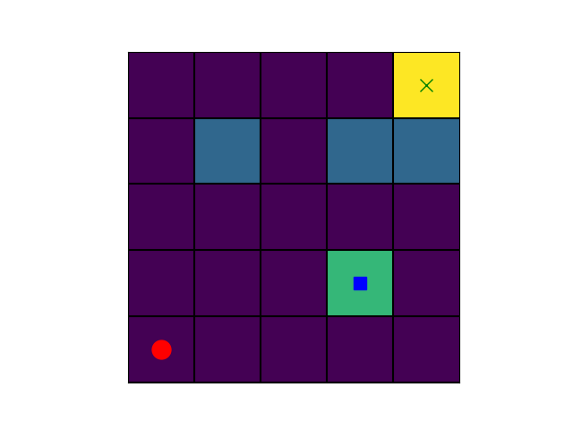
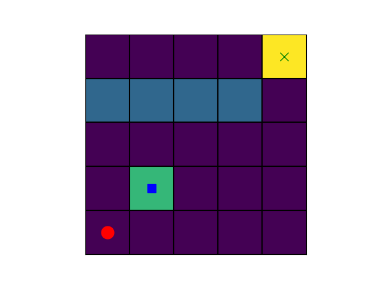
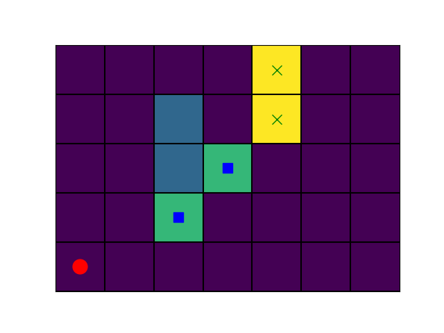
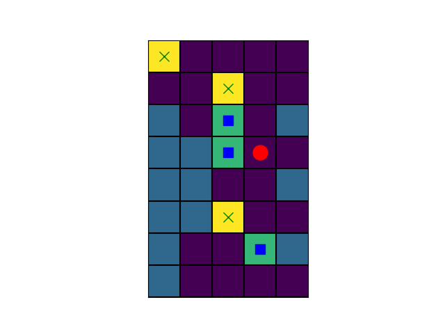
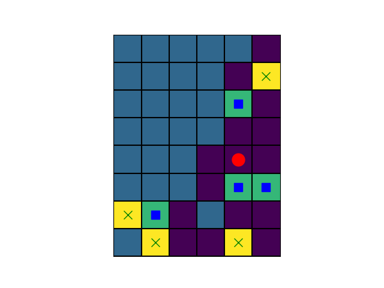
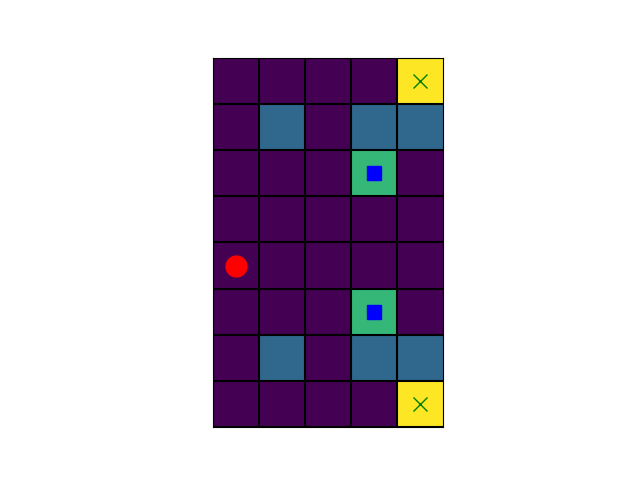
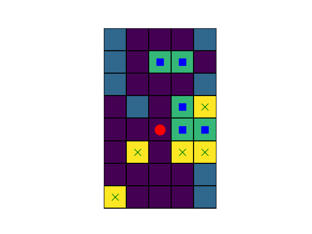
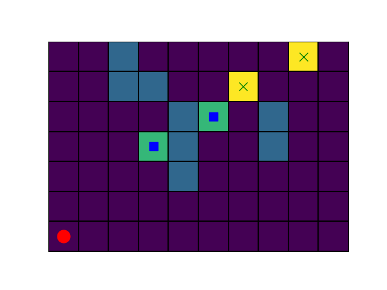
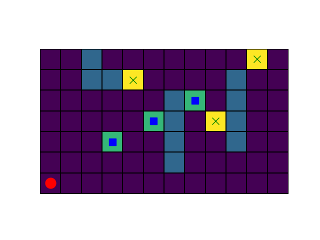

# Test Maps

### Easy 1 - [`easy_map1.yaml`](yaml/easy_map1.yaml)

### Easy 2 - [`easy_map2.yaml`](yaml/easy_map2.yaml)

### Medium 1 - [`medium_map1.yaml`](yaml/medium_map1.yaml)

### Medium 2 - [`medium_map2.yaml`](yaml/medium_map2.yaml)

### Hard 1 - [`hard_map1.yaml`](yaml/hard_map1.yaml)

### Hard 2 - [`hard_map2.yaml`](yaml/hard_map2.yaml)

### Super Hard 1 - [`super_hard_map1.yaml`](yaml/super_hard_map1.yaml)

### Large 1 - [`large_map1.yaml`](yaml/large_map1.yaml)

### Large 2 - [`large_map2.yaml`](yaml/large_map2.yaml)

